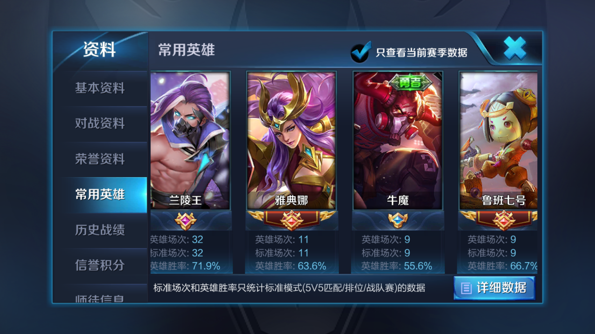

## 佛为心，道为骨，儒为表，大度看队友；
## 技在手，能在胸，思在脑，从容上王者。

# 背景


我是一个菜鸟，一开始接触这个游戏主要是跟朋友一起娱乐，在星耀段位沉浮了两个赛季后，用肝单排上了王者。S12赛季初的半个月后，我平均每天两三把，花了半个多月的时间，用了79场以67%的胜率单排上了王者，我觉得这是一个还不错的成绩了，相信如果我继续认真玩的话，在王者低分局和巅峰赛也会顺利上分。遂把心得记录一下，希望能给各位朋友一点帮助，也算是这段时间的一个自我总结。（PS：当时S12赛季就想写攻略的，现在已经S15赛季了，拖延地太厉害，后面一个赛季单排58%胜率上过30星，后面玩得比较随意了）

对于92的我来说，早已过了游戏的巅峰期，平常有工作和其它事情，也没有时间去刻意练习，铭文只拼凑了一套百穿、半套法师和半套肉铭文，也没有为游戏充过钱。之所以说这些，只是想给你打气，相信你不用氪金，也不用做大量的练习，看了我的总结，只要勤于思考，也会单排上王者，至少可以超越我。



## 游戏不是洪水猛兽
我们很多人都是从小玩到大的，从最早的掌机到小霸王，再到街机，各种电脑游戏，再到手机游戏，现在我们都成年了，也没有被游戏毁掉，当然我们也一起玩沙包，打球踢球，一起听歌，下棋打牌啥的，有时候重要的不仅仅是游戏的乐趣，而是跟你一起玩的人。
现在一些人对游戏存在偏见，好像洪水猛兽，避之不及。其实只要有节制，玩玩游戏还是挺好的，王者打排位是一个烧脑的游戏，玩太多了反而不利于上分，所以也不建议大家持续玩太久。

## 玩排位的目的
我觉得这个是你接下来看我攻略的前提，我玩排位的目的很简单：“赢”！我所有的快感来自于赢，输了比赛，就算拿了败方MVP，我也不会开心，我总会觉得我们会翻盘，从来不会点投降，说得最多的一句话就是“稳住，我们能赢”；可能我从小就比较要强，无论打篮球、踢足球亦或下棋，我总是对胜利充满了渴望，我觉得这很多来自于天性。如果想娱乐或者练英雄，我一般会匹配；

如果你玩游戏的第一目的不是赢，更在意表现自己，如果你对胜利没有那么大的渴望，这篇文章的很多内容并不适合你；

如果你只想要王者标志，那方法也很多，比如找个厉害的大神小号带，比如找人代打，这篇文章也不考虑这些；

如果你已经是王者51星以上的大神了，可能我对游戏的理解还是比较浅薄，请多多包涵，提些建议；

这篇文章主要讲的是：菜鸟如何单排上王者。

## 这是一个智力游戏
首先，认真玩排位很烧脑，它是一个获取各种信息并做出决策的过程，需要专注，我无法以轻松娱乐的心态去玩排位，如果我今天一直在做需要思考的事情，比如看算法和编程，我就不会马上打排位了，如果很累很困，我也不会在这个时候打排位，这个时候可以看看视频啊，或者去玩吃鸡，我反应很慢，玩吃鸡很菜，喜欢开车开船瞎晃，还能看看游戏里的大海和晚霞；

在好的状态，好的网络下玩，真得很重要，就我自己来说，好的状态下如果有70%的胜率的话，差状态下有时候胜率都不足50%；如果状态好，可以玩一些风险高收益大的英雄，比如打野，突进以及需要走位的C位，如果状态差，就优先玩辅助、肉以及后面猥琐丢技能的甄姬姜子牙啥的；

其次，与《魔兽争霸》等需要多线程操作不同，比如打对战的时候，我明明想多路包抄跑狼骑，但操作不过来，总发现外面打架，家里基地忘了升级，这是属于手速跟不上想法，dota有时候也会有类似的情况，用鸡买装备一不小心就把鸡拉到野外了。。。由于王者对操作的要求不高，每个人基本上只要想到就能做到，所以正确的思考在王者荣耀里更加重要；

我从小喜欢下棋，我觉得王者荣耀的博弈跟古代的下棋有点类似，只不过王者里的变数更多，更实时，更加形象，需要一定的操作，我认为王者就是现代版的博弈，是5V5的博弈；

最后一点，因为这是个智力游戏，所以**不要被习惯控制你的大脑**，今天我打了一把王者局，补位辅助，我们家的猴子前期被我养得很肥，拿了很多人头，但是能看出来是很明显的机械记忆玩家，总是脑子一发热冲上去一打五，拉都拉不住，随后我们就被翻盘了，我觉得这位玩家不是在用脑子打游戏，而是用肌肉在玩游戏，如果我当时能提醒他一下，他如果能冷静下来，锁定目标后进场，就不会输了，回头看了一下他的资料，胜率不足50%；

## 这个游戏不简单
王者荣耀刚出来的15年我就下载了，不过玩了两天就删了，当时觉得太简单了，没魔兽和dota好玩。以前我们玩魔兽争霸，觉得控制一支军队挺有意思，后来类似真三和dota出来的时候，感觉好简单，和魔兽相比，只需要控制一个英雄就好了，但是玩了一段时间后发现其实内容蛮多的，后来出现了LOL，更简单了，连反补都没有了，回城不需要TP，买东西不需要鸡，感觉少了很多真实性。我现在很多朋友，也只玩dota不玩王者，都觉得因为简单所以少了很多乐趣，然而我并不敢苟同，这个游戏并不简单。我总结了以下6个阶段，你在哪个阶段呢：

### 1.好简单（萌新：好好玩） 
据我观察，周围以前玩过Dota/LOL的玩家，在刚进入这个游戏的时候，可以轻松上到黄金铂金段位，可能会说：“很简单”，而刚进入Moba类游戏世界的萌新，会感觉好好玩，新手都会在这个阶段熟悉这个游戏规则，任何人都会经过这个阶段而达到阶段2，这个阶段一般集中在白银和黄金段位；

### 2.坑队友 
当你多打几把后，你的水平没法carry了，“坑队友”成为了主要矛盾，队友也不太靠谱，所以你认为是队友坑了你，导致你段位上不去，如果天美团队能统计一下的话，相信包含“坑队友”ID的人在这个段位是最频繁的，“坑队友”阶段的人一般在黄金铂金段位，赛季末可能会上钻石；

难道真的都是别人坑你吗？非也，其实大家都有比较熟悉的英雄，但是依然在互坑，对面的也在互坑，造成这个问题的主要原因是你不理解你队友，雪上加霜的是，因为你被坑多了所以更加不相信队友，导致明明该赢的局没使尽全力输了。

其实除了打野位，我在这个段位胜率也不高，而之所以打野位胜率高，是因为我基本上会把对面的某个位置针对到他心态不稳（可能这时候对面吵起来了），很多时候，在我们崩之前，对面比我们先崩了。

而要早日突破这个阶段，应该从“道”上下功夫，做到理解队友的行为，最好是五个位置都玩过，你就能理解很多队友的行为了，多跟队友沟通，让队友舒服；

### 3.傻逼排位机制 
当你在阶段2做到了理解队友以后，你的操作已经很好了，也知道每个位置该干什么，你上了钻石，在钻石和星耀之间徘徊，由于周围的人也都会玩了，你会偶尔遇到坑，偶尔也会遇到大神带躺，单排胜率一直在50%左右，靠着勇者积分上分，这已经不是技术问题了；

这时候你在想，是不是排位机制故意针对我？非也，大家都一样，反问一句：如果五个你在一起，怎么选人？你能打过对面吗？是不是就是你在坑你？

### 4.55%胜率上王者
你已经很厉害了，有一个位置挺厉害，会根据阵容选人，基本上补的位置也不差，单排上了王者，但是就是容错率比较低，偶尔该赢的局输了，该输的局还是输了，是不是一个赛季能打三四百场甚至更多？你只喜欢打排位，一有时间就打，状态差也打，有时候会连胜，有时候会连败，所以胜率还是在55%以下；

### 5.轻松上王者
这是我们的目标，你有3、4阶段的技术以及对游戏的理解，你的队友基本上处于阶段3和阶段4，自己从各方面做到位，不是自己carry就是他们带你carry，选出的阵容容错率比较高，赢下该赢得局，拼了该拼的局，可能你打得并不多，但65%胜率以上上王者还是可以的；

### 6.大神单排虐菜
一些有名主播和职业选手的水平，他们普遍心态很好，需要一定的操作、天赋和长时间的训练，是专业和业余的差距，我等常人是难以企及了，其它阶段我们都可以达到。当然职业战队更厉害了，是整体的战术素养层面，这里只讲单排；

相信大部分玩家在2.3阶段，其实3 4 5阶段的人技术都差不多，主要差距在思路，看了我的思路，轻松上王者，不是梦。

我曾经就是这样的，轻松上到铂金，熟悉了甄姬和庄周就上到了钻石，再认真一点，拿庄周，狄仁杰、甄姬、白起、姜子牙这种英雄，磕磕绊绊上到星耀，但是接下来在星耀二三徘徊了两个赛季，赢一场，输一场，胜率一直无法突破55%，这中间我先后熟悉了哪吒、牛魔、雅典娜、兰陵王。直到上赛季末和这赛季有了思路以后，才轻松上了王者，本来有望70%胜率上去的，可是在星耀一心态有点急躁，导致多输了几场，心态平复后才一鼓作气上了去，在这期间我一度打到上海浦东第1兰陵王，以及上海市第5兰陵王的称号，由于我打得不多，上王者后没啥追求，胜率后来掉下来了，如果我常打的话，某个熟练的英雄保持省级前十应该是可以的；

因为没有暴击铭文，金币也不多，很多英雄一开始就没玩，手速也不够快，所以玩得都是不难的英雄，但是至少每个位置都有两三个拿的出手的英雄，相信这些英雄你也会玩得很好；

前面讲了这么多背景有点啰嗦，（我还做了删减 /笑哭），但我个人认为背景很重要，有了前提的铺垫，才能有后面的结论。下面分别从心态、道（玄学）、游戏素质、游戏技术、游戏战略以及细节思路六个方面来阐述，总结为一句对联就是：“佛为心，道为骨，儒为表，大度看队友；技在手，能在胸，思在脑，从容上王者。”，其中，每个点都很重要，直接关系着能否上王者；我认为技术是一切的基础，你首先要会玩，相信大部分玩家是有技术的，除了技术的基础地位，其它几个方面如果非要排序的话，我个人认为按照重要性优先级排序如下： 技术是基础：佛为心 > 道为骨 > 儒为表 > 能在胸 > 思在脑；

# 佛为心
要上分，一个平和的心态真的很重要，有以下几点建议：

1. **如果赢了，就立刻继续玩，如果输了就忍住别玩了**。利用王者的排位机制，这个就有点玄学了，（其实这个输了忍住别玩了我也控制不好，有时候一输就是不想停不下来导致连败）：
   1. 假设王者里确实有这个ELO系统，具体可以查阅参考文献，大概意思是你会有个**隐藏分H**，你打得好的话H会很高，这样会给你匹配H较低的队友（猪一样的队友）和H很高的对手（神一样的对手）。很多人为ELO这个系统而苦恼，从另一个方面看，我们可以利用这个机制。(**以下全是个人猜测**)：**这个H的计算是有一定时延的，这个时延应该在10S这个级别以上**（天美在后台肯定在做大数据分布式计算，如果是hive、spark等批处理程序的话，时延在分钟以上级别，如果是用流式处理程序，比如Spark Streaming等的话，时延估计也在10S左右，也没有用毫秒级别延时系统的必要），所以如果你赢了的话，就马上开始第二把，这样你就会用上一把较低的S值在打下一把的比赛。反之，如果输了的话，就休息个一两分钟，就等你的S值降低更新成功了再玩。这样可以有效避免连跪；
2. 如果连续几把一直输，那真的就别玩了，玩玩匹配娱乐，状态不好，心态不好，忍住不玩，是最好的上分方法。
3. 多用版本强势英雄，也不要畏手畏脚，怕输，举个例子，比如当前版本强势英雄是橘右京，其实操作练练就好了，不难上手，简单还厉害，但就是因为我怕坑不敢用，导致错过了很多版本强势英雄和提高自己的时机。

# 道为骨

道是这个游戏通用的准则，是不以版本更迭以及具体细节所改变的真理，我们简单逆推一下游戏之道，怎么才能赢：

1. 在最终决战的时候，我们家阵容比对面阵容合理，那就很可能赢；
2. 在最终决战的时候，我们家真实经济比对面真实经济高，那就很可能赢；
3. 在最终决战的时候，我们家打团比对面打得好，然后推掉高地，那就赢了；

所以这个游戏的一切，都围绕着以下三个点来进行：阵容、经济、团战。具体团战涉及到很多技在手能在胸思在脑的细节，在“道”篇暂时不讲，等下主要讲阵容和经济。

## 阵容很重要

一个合理的阵容的重要性不言而喻，我们讨论两个问题：1.什么是一个合理的阵容？2. 如何才能有一个合理的阵容；

### 1. 什么是一个合理的阵容

估计很多人心中浮现了，张良加东皇？以及大乔加钟馗？达摩白起加鬼谷子？但是套路总是不得人心，每次看到有队友看到选了东皇，有人马上选了张良，我就知道这把悬，实际情况也是如此，输多赢少，说明这些阵容并不一定合理；

**一个合理的阵容，是指在你所在段位的合理阵容，一切围绕着最终决战的时候来，这个要实事求是。**有些在KPL以及高分段里合理的阵容，在钻石局其实不合理，因为在钻石局有以下几个特点：脆皮更不容易死，难以滚雪球，一般都会拖到后期。

自己家阵容合理，就是要有 ：**不容易死的物理伤害 + 不容易死的法术伤害 + 控制 + 让对面输出更容易死的伤害 + 灵活的支援，推塔，兵线处理等**。为了不容易死的物理伤害，可以使用辅助加强力射手的组合，物理法术伤害都要有，否则对面会出针对性更强的防御装，让对面输出死的方式有很多，最常见的就是刺客战士上去怼，当然，也可以选择一些对后排威胁极大的法师和控制。**先考虑让自己家阵容合理，再考虑克制对面的阵容。**

举个例子，目前赛季初的钻石星耀（S15）分段，后羿+牛魔+甄姬+兰陵王+凯，类似这样的队伍就很强，有输出有控制有带线有切后排。如果你没选后羿选了个百里守约，那等到决胜时刻，百里守约的伤害是比不过后羿的，如果没有牛魔之类的英雄，对面刺客稍微会玩一点，你家输出就死了，如果兰陵王和凯能再带带线，稍微切切后排，赢面是很大的，这就是一个比较合理的阵容；更高端一点的局，一些体系阵容会比较常见，比如孙膑体系，大乔电梯流，之前比较火爆的养猪流，这个在低分段一般比较少见，也难以操作，更适合五排；

而在高端局(比如王者30星以上)，马可、公孙离等多段位移的英雄可能更适合作为边射上分，因为高端局对面都会针对脆皮，有多段位移能够增加容错率，节奏比较快，一般有优势就能全队滚起雪球。但是如果同样的马可公孙离你来钻石局来单排玩耍，还是会拖到后期，后期你就是没后羿好用。

阵容里多用版本强势英雄，是提高胜率的重要保障，版本强势英雄不仅仅是英雄强势，而且一般有个特点，就是英雄容错率高，当然厉害的本命也可以的。

### 2.如何才能有一个合理的阵容

1. 你得拓宽自己的英雄池，至少能补三个位置吧，其实拓宽英雄池没那么难，补位选择版本强势的英雄就好了，比如（S15赛季）甄姬，后羿，牛魔，凯，白起这些，打野猴子，典韦就操作简单又厉害；
2. 然后，刚进入选人界面的时候，查看每个队友的情况，一般队友头上会有三个擅长英雄的展示，**长按队友头像，就会说他最近玩了什么位置，这点非常重要，**对每个队友擅长的位置有所了解，然后思考自己用什么英雄**（不太建议各位关闭自己的想玩展示，这样只会给队友的决策带来困惑）**；
3. 这个时候的队友分为三种：专职型、全能型、大神型和未知型。
   1. 专职型玩家王者以下分段占了很大一部分，比如只会菜鲁班，有的女生只会法师，**一般这种玩家，千万别让他补位，他玩鲁班如果是王者水平的话，很可能玩上单还不如铂金！**反之，如果让他如愿选择了最擅长的英雄，他定会给你一份满意的答卷。_
   2. 
   3. 全能型的队友是一套合理阵容的润滑剂，但是也有更擅长或不太擅长的位置，选人的时候一定要跟他们统一思路，尽量让他们后选。

      1. 如果碰到大神型的队友，你就开心吧，大神型队友的特点，就是打得场数非常少，比如其他人玩了有千场多了，而大神型总共才玩了一百多场场，这些人就是小号，用人要用尽其才，大神型的，就尽量让他打擅长的核心位置吧。
      2. 而关闭擅长位置显示的未知型的队友，一般是比较能补位的，但是一定要跟他尽早沟通，此时的沟通，比场上的沟通重要得多；
      3. 如果你自己只擅长某个位置或某个英雄，趁早给队友说，让队友帮你抢；
      4. **主动与队友沟通，成为选人阶段的指挥官吧，指挥官的作用就是让人尽其才，将全队战斗力上升到最大化。**如果是我的话，我会这么说：“三楼你擅长李白？那你打野吧？四楼你就玩鲁班好了？找个人来保你”，一般队友都会支持你，并且能从你的语言里感受到一股对胜利的渴望，他们也会更加有信心。
      5. 有时候我会经过前面的分析后，主动给队友说，我玩哪个位置，比如我看到队友不太擅长射手，那我就会主动申请打射手，让有些队友心中无所挂碍。
      6. 自己家阵容合理的情况下，再谈克制，在钻石局以后，因为是BP模式，所以会有ban选以及克制的问题，这个是需要积累和经验的，比如，典韦克制猴子云中君，切后羿啥的还是兰陵王阿珂舒服，打兰陵王一般狄仁杰好用，打虞姬啥的还是司马懿芈月啊，对面清不动兵线就选米莱迪，一个稳定的牛魔克制所有同等水平刺客的切入，打牛魔这种多肉，选甄姬王昭君这种消耗对面C位血线……一般让上单战士和坦克辅助先选，然后再针对性选择射手法师和打野。
      7. 当队友选择好以后，在游戏加载界面，就要思考如下几个问题：1. 谁估计是坑货？如果只玩菜鲁班的人补位了亚瑟，那他大概率是比较坑的，这种坑货，就要止损，开局提醒他猥琐，该弃塔就弃塔，让他别崩就好；2. 谁是大腿？比如菜鲁班拿了鲁班，那他就是大腿，保护好他，照顾好他，从他那一路滚雪球；3. 对面选了谁，比如我家上单白起抗压抗不过对面狄仁杰，那前期就要针对一下狄仁杰了，4.  我的角色是什么，该怎么玩，进行心理暗示，这个心理暗示很重要，下面讲；

总之，选人阶段，能有一个符合自己段位的合理阵容，是重中之重，多跟队友沟通，提前识别出队友情况，可以主动做意见领袖，把你想象成军师，给每个人分配最合理的活，然后在开局之前大概判断一下抱哪个队友大腿，哪个队友会坑；

## 游戏的不同阶段

进入游戏之后，就开始游戏了，咱们现在只讲“道”的方面：

一场战争，分为**战略防御阶段、战略相持阶段、战略进攻阶段，战略决胜阶段**，四个阶段是可以相互转化的，如果我们家处于战略防御阶段，那对面就处于战略进攻阶段或战略决胜阶段；

一般一开局，双方都是战略相持阶段，随着比赛的进行，会有一边处于战略防御阶段，一边处于战略进攻阶段，最后会有一边处于战略决胜阶段，当然也有可能两边同时处于战略决胜阶段的情况；

**脑子里时刻清楚目前我们处于哪个阶段，是赢得比赛之道。而钻石局很多小伙伴，心里没有这个概念，是他还在永恒钻石或星耀的根本原因。**

那如何判断处于哪个阶段呢，很简单，**看经济和防御塔** 。

经济的概念容易理解，看经济面板就好了，**经济面板请设置成按照经济排序，**就像之前说得，在阵容差不多的情况下，我们家有效经济比对面有效经济高，那打架就能赢，什么是有效经济，就是你的经济转化成为了装备，举个例子，4100块和3500块的经济是差不多的，如果你在憋破军，手里有1000块钱没有转化成装备，那依然不算有效经济，这个时候就要避其锋芒，等破军做出来之后再跟他们干，如果全队的经济在牛魔孙膑身上，那这个经济肯定不如射手或法师身上有效。一般情况下，不需要看这么仔细，只需要大概知道个经济的数量就好了；

防御塔也很容易理解，防御塔是一个特殊的能抗能打有视野的靠谱队友，尤其是中塔，千万不要因为一些支援的原因让它被人推掉，中塔的失手，代表着你中路视野的丢失，代表着你野区视野的丢失，对面拔掉你的中塔以后，就能滚雪球，进能入侵野区压制你经济，退能兵线带过去然后拿龙压制你经济。

所以一般情况下，开局大家都是战略相持阶段，如果你们阵容前期羸弱后期强势，那一开始你们就是战略防御阶段，你推掉对面中塔和边塔后你们处于战略进攻阶段，而兵线运营差不多，有一定的装备差距以后，准备推高地塔打团的时候处于战略决胜阶段。

这里并没有把等级的概念放进去，是为了简化判断，其实等级在前期是比较重要的，最重要的两个节奏点就是二级和四级的时候，越到后面，等级的作用就越来越微弱；

### 战略相持阶段

战略相持阶段，一般是指进入游戏的前中期，此时两边都差不多，我们的目标，就是从战略相持阶段过渡到战略进攻阶段，也就是：**拿经济，拿外塔，提高等级，所谓的打架，都是为经济，外塔，提高等级而服务的。**这点很重要很重要，很多钻石星耀的小朋友不明白为什么打架，很多人看到有人就去打了，以为多拿人头就能赢，有的打野前期为了一个人头，傻傻地在旁边蹲一分钟，自己家的野怪没人打，这就很亏了，性价比很低。

#### 如何提高经济？

经济分为自然经济+小兵经济+补刀经济+野区经济+人头经济+辅助装每5秒5块的经济；

不考虑人头经济的情况下，补刀每个小兵，并且所有人分享小兵和野区，辅助经济永远处于全队最低的位置，全队经济是最高的；

所以说，线上的小朋友，现在这个版本请重视补刀，补刀额外会多40%的经济，前排小兵各63g，后排小兵42g，请重视兵线，一波兵全收，你会获得大约200块的经济；简单介绍几个场景大家一起探讨：

1. **场景1：**前期中路跑到边路去支援，中路丢了一波兵线，塔也被磨了1/3的血。这个场景具亏啊，你丢了200块钱，拿了人头还好，损失能持平，如果拿不到人头，全队经济少了200块。所以我认为，中路支援的时候，看到兵线到了，就赶紧撤退去守中塔；
2. **场景2：**有点人被蹭了线很烦，觉得自己吃亏了。其实我觉得大部分情况下是不亏的，共享兵线每个人有80%的经济收益，也就是两个人有160%的收益，所以比你单吃线对整体经济更高，更优的方式是边路或打野蹲在草丛蹭一下中路的线，或抓人或快速清兵，然后大家一起欢欢喜喜去上路再一起抓人清兵，这样对全队的收益是最高的。所以我认为，不要下意识地排斥队友蹭线，这个版本线上经济比野区经济高，所以打野反而要多蹭线，否则经济不够，快速清兵支援全队收益更高。值得注意的是，对打野和中单来说，前期升2级和4级对他们来说异常重要，所以蹭线最好不要影响他们的关键升级；这里提醒一句，有些主播打得比较自私，这是不好的例子，因为主播技术好，在比他水平低的段位当然可以这么打，也为了直播效果，大家不要学这点；
3. **场景3：**只想着杀人的打野，有的打野只想着杀人，但是不推塔蹭线不刷野。这个要避免，两队的线上经济是一样的，但是野区经济是不一样的，野怪杀了以后它马上会进行刷新周期，所以如果要提高全队经济，就要在野怪刚出生的时候将它杀死，如果中期以后你正好在上路，刷不了下路的野，可以主动告诉下路的射手，把这些野刷了，这样全队经济会更高，这是一种稳妥的打法。

##### 如何推塔
基本上谁先推掉对面的外塔，谁就占有主动权，就可以过渡到战略进攻阶段了，那如何推塔呢，当前版本目前是这样的：
1. 前三分钟防御塔有保护机制，推塔不划算，所以优势路一般建议消耗对面血量为主，消耗血量的目的是为了经济，其中一个重要的经济点就是那只蜥蜴；对于边路来说，谁拿了那只蜥蜴，谁就稍微占点主动权。而对于防守方来说，尽量补刀，然后不要被消耗太多血，能怂就怂，反正前期点塔也不快，打野嘛，就是刷野；
2. 两分钟的时候暴君会刷新，这只暴君是兵家必争之资源，一般谁先拿暴君谁就优先到四级，这时候你消耗对面的血量的好处就体现出来了，一般对于阵容稍优的一方来说，一定要拿这个暴君，那什么是阵容稍优呢，就是暴君路爆发团战，你们战斗力更强。
3. 在较低段位，很多人意识不到暴君的重要性，所以只要打野带着辅助和一个边路，做好视野，都能把暴君拿下，中单清完线后也能过去帮一下。而在高端局，大家都想拿暴君，那怎么办呢，这个时候就要思考：我们（四个）能打过他们（四个）吗？如果能打过，就拿，如果打不过，就可以在另外一边避战压塔，做点其它事情；所以在选择刷野路线的时候，就要思考到2分钟的暴君我们能否打得过这个问题；
4. 3分钟后，这个时候就以推塔为主，推塔是以射手为核心，但不仅仅是射手的事，一般是打野带着辅助，中路跟上，去射手路形成以多打少的局面，杀人拿塔，或把人逼回家即可，塔比人头重要；当然，你也可以反其道行之，知道对面要来拿塔，你们可以反蹲他们，要做到这点，辅助的视野很重要，打野需要根据辅助的视野来思考方案，而辅助和中单会跟着打野的思路走，这就是中野辅联动。
5. 一个边路的塔推完了以后，除了刷野和收线，就要考虑到推中塔了，这个一般是由射手主导的，最好的方案是射手逐步去磨中路塔，而打野去射手路清线，补点经济；这里涉及到很多具体的战术，后面战术篇再讲。

中塔推完后，我们经济会有稍微领先，接下来就会进入战略进攻阶段，反之进入战略防御阶段。
#### 战略进攻阶段
在战略进攻阶段，我们要做得事情就是滚雪球。它的目的不是杀人，杀人只是途径，目的是拉开双方的经济差，顺便把二塔拿了，尽早把局势推向战略决胜阶段：
那如何拉开双方的经济差呢？很简单，入侵反野，带线，然后拿龙，让对面只能可怜地吃到塔下的小兵。在能打得过的情况下，积极入侵野区，刷对面的野，龙肯定是我们的。这样滚一段时间的雪球，对面二塔也会掉得只剩下高地塔；
在这个阶段，要带领队伍打得更加具有侵略性，最好不要给对面喘息的时间。蔡文姬这个英雄之所以一定程度上胜率高，我个人认为就是蔡文姬的续航导致进入战略进攻阶段的队伍可以持续压制入侵，磨对面高地塔，缩短战略进攻阶段的时间，早日进入战略决胜阶段。
这个阶段，对面一般会死守高地，而我们会想着上高地，当双方经济差距不大的时候，你是不敢上高地的，因为高地塔易守难攻，此时你要拿大龙，慢慢磨塔，等待时机成熟。
#### 战略防御阶段
反之，当对面进入战略进攻阶段的时候，我们就进入的战略防御阶段了，也就是劣势局。我发现很多钻石星耀朋友，在劣势局的时候，根本意识不到自己处于劣势局，这是一个低段位和高段位非常重要的区别。
##### 请意识到自己处于劣势局
当我们打不过他们的时候，就处于劣势局啦，一般这个时候经济落后，外塔被拔了，野区失守。心里告诉自己，告诉队友，劣势，劣势，劣势。
##### 劣势局怎么办
到了劣势局，我们的目标就是将战略防御阶段转换为战略相持阶段，或者转换为战略决胜阶段。
前期的劣势，我们就能将其转换为战略相持阶段，而当你拖到打后期，大家都是五神装的时候，也就直接到了战略决胜阶段，虽然我们3000块的时候打不过人均5000块的对手，但13000块和16000块是一样的。所以暂时处于劣势不要放弃，不要灰心，稳住，拖到后期，我们就能赢！
这个时候要做的事情就是：**避战，清兵，偷发育，反蹲**。
**避战**，就是不在外面跟他们正面打架，打不过啊，有时候看到小伙伴（没错，就是你小仙女）冲上去刚正面，我是拉也拉不住。如果队友不知道，拉不住的话，发“开始撤退”，如果他还不听，可以考虑发：“我们现在打不过，赶紧跑呀”之类的文字，提醒队友注意当前的形势。当然这种情况段位越高越少见；
**清兵**，就是清兵啦，在兵线快到塔下的时候快速把兵清了，减少磨塔的损失，所以一开始选阵容的时候，最好要有清兵快的英雄，比如王昭君清兵就很恶心；
**偷发育**，就是可以反其道行之偷发育，举个例子，比如你是打野，就可以绕开视野偷刷对面的野，或者带线然后跑，能带线的边路，比如程咬金，李信，芈月之类的可以尝试把边路线带出去，然后跑。当然你个小鲁班小甄姬就别想着去带线了，老老实实在家清兵。
**反蹲**，这是破釜沉舟的进阶打法，往往会起到不错的效果，绕开对方视野，一起蹲在草丛里，然后等对面人过来瞬间形成以多打少之势。扭转战局，进入相持阶段或决胜阶段。
#### 战略决胜阶段
战略决胜阶段是指打团赢一波就能推高地的那种阶段；分为两种情况：
1. 我方战略决胜阶段：
  处理兵线，拿黑暗暴君，然后打。最好的情况下，是三路兵线到对面塔下，我们有暴君buff加成，然后我们经济领先一个大件，这种情况下，只要跟着兵线越塔强上，干就是了；
  越塔强上干的时候，一定要果断，机不可失时不再来，就怕这个时候没人敢上，导致慢慢变成双方战略决胜阶段，所以需要有人第一个上，一般情况下队友看到你上了就会跟上；
  这个阶段一定要处理好兵线，这样就算强上高地上不去，也不至于被一波，复活之后还能继续打。任何决定都是有风险的，我们要做得只有降低风险，如果对面清兵线能力比较强，我们就压线让两路或者三路兵线上高地，然后找个突破口上高地。
2. 双方战略决胜阶段：
  这是一个容易让人扼腕叹息的阶段，双方谁处理得好就能一波，这里涉及到很多战术层面的东西，这个时候建议大家不要浪，打得保守一点，蹲人很重要，视野很重要，比拼每个人的发挥，有时候真的靠点运气，后面有机会战术篇再讲。

不同的阶段讲完了，大家一定要能意识到自己当前所处的阶段，这决定着比赛的走势，大家多思考，在游戏中多多心理暗示，一定会对胜利有帮助。

# 儒为表

就是不要喷队友，是提高胜率非常重要的部分。我是没有这个问题的，从来没有喷过人呢，也不会喷，但是的确碰到过脾气暴躁的队友，这对游戏的胜率以及体验都造成了不好的影响，有时候明明处于战略相持阶段，因为队友的一句话，比如抢了野了啥的，直接进入战略防御阶段，然后心情不爽的队友开始浪，然后就输了。

玩游戏难免会碰到素质差的坑队友，~~这个时候就需要控制自己的情绪，不要影响自己的发挥；~~前面这句话是废话，大道理人人都懂，小情绪却难以自控。怎么办呢？我有以下几个看法：

1. 所谓隐忍，隐忍不是怂，而是因为我们对胜利的渴望，我们有更高的目标：赢。我们就把王者之路当成一种修行，《素书》有云：“夫志心笃行之术。长莫长于博谋，安莫安于忍辱”，我们的长谋就是上王者，为了这个长远的目标，我们才谈忍，不因小失大；
2. 如果实在控制不了小情绪，就关闭局内打字，专心致志，心无旁骛；
3. 脾气大控制不住自己的看官，局内请忍住不要喷队友啦，只要喷肯定会对胜利有影响，因为遇到心态不好的人，一被喷就不认真打了，就当是一种修行，打完可以再举报；
4. 可以准备一些安抚人心的话，比如有点失误送一血了，你发一句，“我的失误”，“稳住，我们能赢”，队友提醒你的时候，你发一句“收到”，不小心抢了蓝，就发一句“对不起，我不是故意的”，相信队友会心里踏实很多；

还有以下几点可以避免队友心态不好，举个例子：

比如你是法师，在想拿之前可以问一句，“我能拿蓝吗？”，如果队友不给就别拿了，如果队友给你，说不定还会帮你打，我在打野的时候，一般后期我会发一句“法师来拿蓝”，队友会很开心。有几次我主动让蓝给法师，法师后面都加我了哈哈~O(∩_∩)O~。

说实话，其实每个玩家一般情况下都不错，只要你主动奉献，营造一个和谐的氛围，对胜率的提高真的很大。

写到这里，这个攻略的前半部分就写完了，主要讲的是大的方面，玩王者，思考很重要，要有逆向思维的意识，可以多进行心理暗示。后面有机会了总结一下，技巧，提高方法，战术以及思路。

加油哦，你很优秀很棒的O(∩_∩)O，其实你已经学了很多技巧方面的知识，希望能对你有帮助。