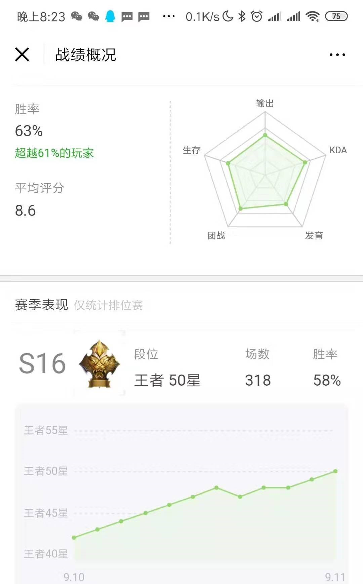
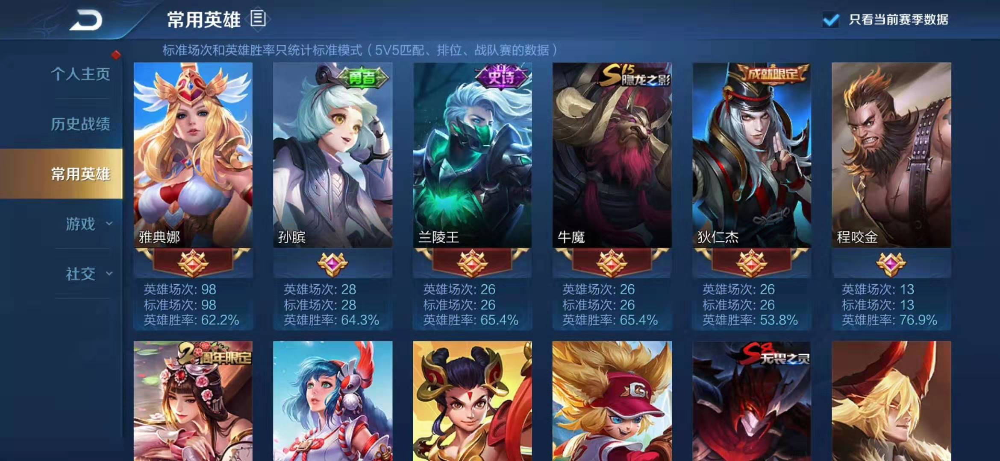

## 背景

我是一只程序猿，一开始接触王者荣耀主要是跟同事娱乐。S12赛季初，我平均每天两三把，花了半个多月的时间，以67%的胜率单排上了王者，后面划水了几个赛季，S16赛季我想单排冲个荣耀，平均每天4把自闭单排，到赛季中的时候以58%的胜率单排上了荣耀50星。这个战绩虽然跟巅峰大神们不能比，但相对我的技术来说是很满意的。先上图：

在王者路上我曾看过一些很好的攻略，感觉受益匪浅，对我上分帮助很大。我也把我的上分心得也给大家分享一下，予人玫瑰，手有余香，也算是对这份经历的一个总结。

我都毕业好几年了，早已过了游戏的巅峰期，平常有工作和其它事情，没有时间去刻意练习，也没有氪金，大学时候有过dota基础，但这个真心不重要，所以我技术以及反应是比较慢的。我觉得这份攻略适合那些跟我一样天赋不足，手速很慢，没精力深入研究每个英雄，但愿意思考的(尤其女)玩家。相信你也不用花太多时间，看了我的总结，只要勤于思考，也会单排上王者。

今天要分享的主题是：我所理解的战略性思维。

## 战略性思维

王者荣耀操作还是比较简单的，不像CS/魔兽这种游戏需要快速的反应和手速，也没有dota里的补刀和反补操作。因此在这个游戏里思维是至关重要的，思维分为战略性思维和战术性策略，（战术性策略套路多，变化多样，这节先不提），战略性思维是最重要的，而且是基本通用的，这对于上分来说至关重要。

玩王者荣耀更像是在下一盘棋，但每个棋子的变化，所能表达的信息是象棋无法比拟的。

我看到有些好友花了大量时间和精力苦练某一个英雄，对每个英雄的技能了如指掌，顺风超神轻轻松松，在我看来比我厉害多了，但最后还是只能在钻石星耀局徘徊，如果你觉得跟你很像的话，我觉得这篇有关战略的文章会帮助到你。

## 游戏的不同阶段

进入游戏之后，就开始游戏了，咱们现在只讲“战略”的方面：

一场战争，分为**战略防御阶段、战略相持阶段、战略进攻阶段，战略决胜阶段**，四个阶段是可以相互转化的，如果我们家处于战略防御阶段，那对面就处于战略进攻阶段或战略决胜阶段。

如上图，一般一开局，双方都是战略相持阶段，随着比赛的进行，会有一边处于战略防御阶段，一边处于战略进攻阶段，最后会处于战略决胜阶段，当然在高端局如果你意识到你们家前期强势的话，可以配合队友趁早进入战略进攻阶段(比如老虎牛魔去反野)，反之亦然；

**脑子里时刻清楚目前我们处于哪个阶段，是赢得比赛之道。**而很多小伙伴，心里没有这个概念。具体表现在，只会用一套固定的模式打所有的比赛，比如一直用战略进攻阶段的思路玩游戏（点名很多钻石星耀的猴子玩家），如果是顺风局当然很好，你能超神，那如果前期阵容不好呢，如果是逆风局呢？你是不是往往是超鬼的那一个？

很多人会觉得我描述这些显而易见的内容好像没有什么用，看文章大家都能想明白，重点在于，你能否在游戏中思考一下这个问题，其实我也常常做得不好，但稍微想一下也能躺上荣耀，可见其重要性。**认清形势，知道我们队伍目前正处于哪个阶段，就会心里有数，永远不慌。知道每个阶段该做什么事，这样的话，在别人只会抱怨投降的时候，你能够看到胜利的曙光；在队友开始膨胀嘲讽的时候，你能意识到隐藏的危机并避免它，稳住，我们能赢。**

那如何判断我们处于哪个阶段呢，这是一个综合性的判断，对游戏理解得深刻了就会比较容易判断，一般有两点：**1：看阵容**，(阵容又是另外一个大话题了)，接下来主要讨论一个简单的指标， **2：看经济和防御塔** 。

经济的概念容易理解，看经济面板就好了，**经济面板请设置成按照经济排序，**就像之前说得，在阵容差不多的情况下，我们家有效经济比对面有效经济高，那打架就能赢，什么是有效经济，就是你的经济转化成为了装备，举个例子，4100块和3500块的经济差了600块，如果你在憋破军，手里有1000块钱没有转化成装备，那依然不算有效经济，这个时候就要避其锋芒，等破军做出来之后再跟他们干，如果全队的经济在牛魔孙膑身上，那这个经济肯定不如射手或法师身上有效。一般也不需要看这么仔细，只需要大概知道个经济就好了；

防御塔也很容易理解，防御塔是一个特殊的能抗能打有视野的靠谱队友，尤其是中塔，千万不要因为一些支援的原因让它被人推掉，中塔的失手，代表着你中路视野的丢失，代表着你野区视野的丢失，对面拔掉你的中塔以后，就能滚雪球，进能入侵野区压制你经济，退能兵线带过去然后拿龙压制你经济。

所以一般情况下，开局大家都是战略相持阶段，如果你们阵容前期羸弱后期强势，那一开始你们就是战略防御阶段，你推掉对面中塔和边塔后你们处于战略进攻阶段，而兵线运营差不多，有一定的装备差距以后，准备推高地塔打团的时候处于战略决胜阶段。

这里并没有把等级的概念放进去，是为了简化判断，其实等级在前期是比较重要的，最重要的两个节奏点就是二级和四级的时候，越到后面，等级的作用就越来越微弱；

### 战略相持阶段

战略相持阶段，一般是指进入游戏的前中期，此时两边都差不多，我们的目标，就是从战略相持阶段过渡到战略进攻阶段，也就是：**拿经济，拿外塔，提高等级，所谓的打架，都是为经济，外塔，提高等级而服务的。**这点很重要很重要，很多钻石星耀的小朋友不明白为什么打架，很多人看到有人就去打了，以为多拿人头就能赢，有的打野前期为了一个人头，傻傻地在旁边蹲一分钟，自己家的野怪没人打，这就很亏了，性价比很低。

#### 如何提高经济？

经济分为自然经济+小兵经济+补刀经济+野区经济+人头经济+辅助装每5秒5块的经济；

不考虑人头经济的情况下，补刀每个小兵，并且所有人分享小兵和野区，辅助经济永远处于全队最低的位置，全队经济是最高的；

所以说，线上的小朋友，现在这个版本请重视补刀，补刀额外会多40%的经济，前排小兵各63g，后排小兵42g，请重视兵线，一波兵全收，你会获得大约200块的经济；简单介绍几个场景大家一起探讨：

1. **场景1：**前期中路跑到边路去支援，中路丢了一波兵线，塔也被磨了1/3的血。这个场景巨亏啊，你丢了200块钱，拿了人头还好，损失能持平，如果拿不到人头，全队经济少了200块。所以我认为，中路支援的时候，看到兵线到了，就赶紧撤退去守中塔；
2. **场景2：**有人被蹭了线很烦，觉得自己吃亏了。其实我觉得大部分情况下是不亏的，共享兵线每个人有80%的经济收益，也就是两个人有160%的收益，所以比你单吃线对整体经济更高，更优的方式是边路或打野蹲在草丛蹭一下中路的线，或抓人或快速清兵，然后大家一起欢欢喜喜去上路再一起抓人清兵，这样对全队的收益是最高的。所以我认为，不要下意识地排斥队友蹭线，这个版本线上经济比野区经济高，所以打野反而要多蹭线，否则经济不够，快速清兵支援全队收益更高。值得注意的是，对打野和中单来说，前期升2级和4级对他们来说异常重要，所以蹭线最好不要影响他们的关键升级；这里提醒一句，有些主播打得比较自私，这是不好的例子，因为主播技术好，在比他水平低的段位当然可以这么打，也为了直播效果，大家不要学这点；
3. **场景3：**只想着杀人的打野，有的打野只想着杀人，但是不推塔蹭线不刷野。这个要避免，两队的线上经济是一样的，但是野区经济是不一样的，野怪杀了以后它马上会进行刷新周期，所以如果要提高全队经济，就要在野怪刚出生的时候将它杀死，如果中期以后你正好在上路，刷不了下路的野，可以主动告诉下路的射手，把这些野刷了，这样全队经济会更高。

#### 如何推塔
基本上谁先推掉对面的外塔，谁就占有主动权，就可以过渡到战略进攻阶段了，那如何推塔呢，当前版本目前是这样的：
1. 前三分钟防御塔有保护机制，推塔不划算，所以优势路一般建议消耗对面血量为主，消耗血量的目的是为了经济，其中一个重要的经济点就是那只蜥蜴；对于边路来说，谁拿了那只蜥蜴，谁就稍微占点主动权。而对于防守方来说，尽量补刀，然后不要被消耗太多血，能怂就怂，反正前期点塔也不快，打野嘛，就是刷野；
2. 两分钟的时候暴君会刷新，这只暴君是兵家必争之资源，一般谁先拿暴君谁就优先到四级，这时候你消耗对面的血量的好处就体现出来了，一般对于阵容稍优的一方来说，一定要拿这个暴君，那什么是阵容稍优呢，就是暴君路爆发团战，你们战斗力更强。
3. 在较低段位，很多人意识不到暴君的重要性，所以只要打野带着辅助和一个边路，做好视野，都能把暴君拿下，中单清完线后也能过去帮一下。而在高端局，大家都想拿暴君，那怎么办呢，这个时候就要思考：我们（四个）能打过他们（四个）吗？如果能打过，就拿，如果打不过，就可以在另外一边避战压塔，做点其它事情；所以在选择刷野路线的时候，就要思考到2分钟的暴君我们能否打得过这个问题；
4. 3分钟后，这个时候就以推塔为主，推塔是以射手为核心，但不仅仅是射手的事，一般是打野带着辅助，中路跟上，去射手路形成以多打少的局面，杀人拿塔，或把人逼回家即可，塔比人头重要；当然，你也可以反其道行之，知道对面要来拿塔，你们可以反蹲他们，要做到这点，辅助的视野很重要，打野需要根据辅助的视野来思考方案，而辅助和中单会跟着打野的思路走，这就是中野辅联动。
5. 一个边路的塔推完了以后，除了刷野和收线，就要考虑到推中塔了，这个一般是由射手主导的，最好的方案是射手逐步去磨中路塔，而打野去射手路清线，补点经济；这里涉及到很多具体的战术，后面战术篇再讲。

中塔推完后，我们经济会有稍微领先，接下来就会进入战略进攻阶段，反之进入战略防御阶段。
### 战略进攻阶段
在战略进攻阶段，我们要做得事情就是**滚雪球**。它的目的不是杀人，杀人只是途径，目的是拉开双方的经济差，顺便把二塔拿了，尽早把局势推向战略决胜阶段：
那如何拉开双方的经济差呢？很简单，入侵反野，带线，然后拿龙，让对面只能可怜地吃到塔下的小兵。在能打得过的情况下，积极入侵野区，刷对面的野，龙肯定是我们的。这样滚一段时间的雪球，对面二塔也会掉得只剩下高地塔；
在这个阶段，要带领队伍打得更加具有侵略性，最好不要给对面喘息的时间。蔡文姬这个英雄之所以一定程度上胜率高，我个人认为就是蔡文姬的续航导致进入战略进攻阶段的队伍可以持续压制入侵，磨对面高地塔，缩短战略进攻阶段的时间，早日进入战略决胜阶段。
这个阶段，对面一般会死守高地，而我们会想着上高地，当双方经济差距不大的时候，你是不敢上高地的，因为高地塔易守难攻，此时你要拿大龙，慢慢磨塔，等待时机成熟。

### 战略防御阶段
反之，当对面进入战略进攻阶段的时候，我们就进入的战略防御阶段了，也就是劣势局。我发现很多钻石星耀朋友，在劣势局的时候，根本意识不到自己处于劣势局，这是一个低段位和高段位非常重要的区别。
#### 请意识到自己处于劣势局
当我们打不过他们的时候，就处于劣势局啦，一般这个时候经济落后，外塔被拔了，野区失守。心里告诉自己，告诉队友，劣势，劣势，劣势。
#### 劣势局怎么办
到了劣势局，我们的目标就是将战略防御阶段转换为战略相持阶段，或者转换为战略决胜阶段。
前期的劣势，我们就能将其转换为战略相持阶段，而当你拖到打后期，大家都是五神装的时候，也就直接到了战略决胜阶段了，虽然我们3000块的时候打不过人均5000块的对手，但13000块和16000块是一样的。所以暂时处于劣势不要放弃，不要灰心，稳住，拖到后期，我们就能赢！
这个时候要做的事情就是：**避战，清兵，偷发育，反蹲**。
**避战**，就是不在外面跟他们正面打架，打不过啊，有时候看到小伙伴（没错，就是你）冲上去刚正面，我是拉也拉不住。如果队友不知道，拉不住的话，发“开始撤退”，如果他还不听，可以考虑发：“我们现在打不过，赶紧跑呀”之类的文字，提醒队友注意当前的形势。当然这种情况段位越高越少见；
**清兵**，就是清兵啦，在兵线快到塔下的时候快速把兵清了，减少磨塔的损失，所以一开始选阵容的时候，最好要有清兵快的英雄，比如王昭君清兵就很恶心；
**偷发育**，就是可以反其道行之偷发育，举个例子，比如你是打野，就可以绕开视野偷刷对面的野，或者带线然后跑，能带线的边路，比如程咬金，李信，芈月之类的可以尝试把边路线带出去，然后跑。当然你个小鲁班小甄姬就别想着去带线了，老老实实在家清兵。
**反蹲**，这是破釜沉舟的进阶打法，往往会起到不错的效果，绕开对方视野，一起蹲在草丛里，然后等对面人过来瞬间形成以多打少之势。扭转战局，进入相持阶段或决胜阶段。

### 战略决胜阶段
战略决胜阶段是指打团赢一波就能推高地的那种阶段；分为两种情况：
1. 我方战略决胜阶段：
    处理兵线，拿黑暗暴君，然后打。最好的情况下，是三路兵线到对面塔下，我们有暴君buff加成，然后我们经济领先一个大件，这种情况下，只要跟着兵线越塔强上，干就是了；
    越塔强上干的时候，一定要果断，机不可失时不再来，就怕这个时候没人敢上，导致慢慢变成双方战略决胜阶段，所以需要有人第一个上，一般情况下队友看到你上了就会跟上；
    这个阶段一定要处理好兵线，这样就算强上高地上不去，也不至于被一波，复活之后还能继续打。**任何决定都是有风险的，我们要做得只有降低风险**，如果对面清兵线能力比较强，我们就压线让两路或者三路兵线上高地，然后找个突破口上高地。
2. 双方战略决胜阶段：
    这是一个容易让人扼腕叹息的阶段，双方谁处理得好就能一波，这里涉及到很多战术层面的东西，这个时候建议大家不要浪，打得保守一点，蹲人很重要，视野很重要，比拼每个人的发挥，有时候真的靠点运气，后面有机会战术篇再讲。

不同的阶段讲完了，大家一定要能意识到自己当前所处的阶段，这决定着比赛的走势，大家多思考，在游戏中多多心理暗示，一定会对胜利有帮助。

## 结尾

最后希望我的心得能给大家一些帮助，祝大家早日达到希望的段位，给平淡的人生加点色彩，在游戏中找到快乐~o(n_n)o~