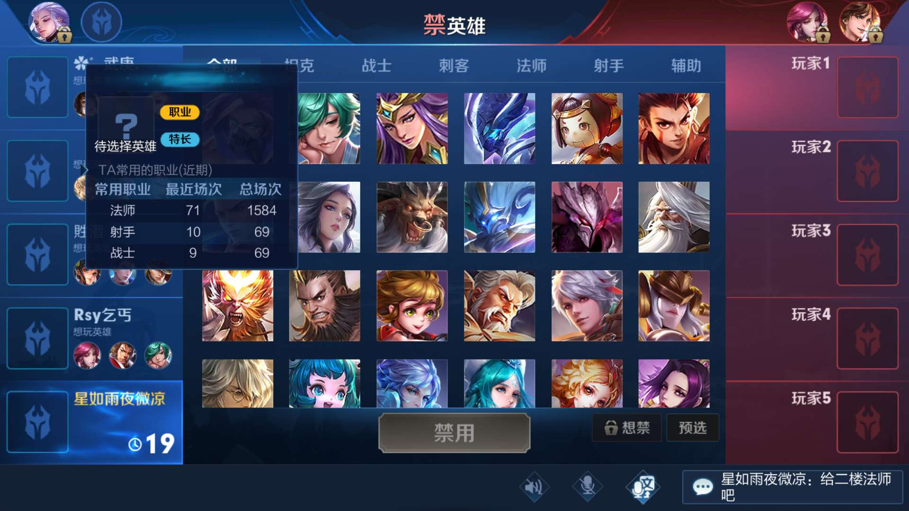

## 背景

我是一只程序猿，一开始接触王者荣耀主要是跟同事娱乐。S12赛季初，我平均每天两三把，花了半个多月的时间，以67%的胜率单排上了王者，后面划水了几个赛季，S16赛季我想单排冲个荣耀，平均每天4把自闭单排，到赛季中的时候以58%的胜率单排上了荣耀50星。这个战绩虽然跟巅峰大神们不能比，但相对我的技术来说是很满意的。先上图：

在王者路上我曾看过一些很好的攻略，感觉受益匪浅，对我上分帮助很大。我也把我的上分心得也给大家分享一下，予人玫瑰，手有余香，也算是对这份经历的一个总结。

我都毕业好几年了，早已过了游戏的巅峰期，平常有工作和其它事情，没有时间去刻意练习，也没有氪金，大学时候有过dota基础，但这个真心不重要，所以我技术以及反应是比较慢的。我觉得这份攻略适合那些跟我一样天赋不足，手速很慢，没精力深入研究每个英雄，但愿意思考的(尤其女)玩家。相信你也不用花太多时间，看了我的总结，只要勤于思考，也会单排上王者。

今天要分享的心得是：合理的阵容。我所有的心得只适用于荣耀王者60星以下，以及巅峰赛1800分及以下，更高的段位，以及KPL比赛，我发觉跟我玩得是两个游戏。

## 合理的阵容

一个合理的阵容的重要性不言而喻，我们讨论两个问题：

   1.什么是一个合理的阵容？

2. 如何才能有一个合理的阵容；

### 1. 什么是一个合理的阵容

估计很多人心中浮现了，张良加东皇？以及大乔加钟馗？达摩白起加鬼谷子？但是套路总是不得人心，每次看到有队友看到选了东皇，有人马上选了张良，我就知道这把悬，实际情况也是如此，输多赢少，说明这些阵容并不一定合理；

**一个合理的阵容，是指在你所在段位的合理阵容，一切围绕着最终决战的时候来，这个要实事求是。**有些在KPL以及高分段里合理的阵容，在钻石局其实不合理，因为在钻石局有以下几个特点：脆皮更不容易死，难以滚雪球，一般都会拖到后期。

还有一点很重要，有些人一直发，来个白起，来个牛魔...，队友被迫选了以后发现根本不会玩，所以那些所谓的合理阵容，是建立在队友对英雄理解深刻的基础上的，而很多情况下队友的英雄池是比较浅的，所以只能尽最大可能让队伍的阵容变得合理，而不是为了所谓合理的阵容，让队友(或自己)选择不会的英雄。我觉得在王者30星局以下，一个擅长的英雄很多时候比合理的英雄更重要，我对偶尔选到的双法师双射手是不太排斥的，反而我觉得挺强。

自己家阵容合理，就是要有 ：**不容易死的物理伤害 + 不容易死的法术伤害 + 控制 + 让对面输出更容易死的伤害 + 灵活的支援，推塔，兵线处理等**。为了不容易死的物理伤害，可以使用辅助加强力射手的组合，物理法术伤害都要有，否则对面会出针对性更强的防御装。让对面输出死的方式有很多，最常见的就是刺客战士上去怼，当然，也可以选择一些对后排威胁极大的法师和控制。**先考虑让自己家阵容合理，再考虑克制对面的阵容。**

举个例子，目前赛季初的钻石星耀（S15赛季）分段，后羿+牛魔+甄姬+兰陵王+凯，类似这样的队伍就很强，有输出有控制有带线有切后排。如果你没选后羿选了个百里守约，那等到决胜时刻，百里守约的伤害是比不过后羿的，如果没有牛魔之类的英雄，对面刺客稍微会玩一点，你家输出就死了，如果兰陵王和凯能再带带线，稍微切切后排，赢面是很大的，这就是一个比较合理的阵容；更高端一点的局，一些体系阵容会比较常见，比如孙膑体系，大乔电梯流，之前比较火爆的养猪流，这个在低分段一般比较少见，也难以操作，更适合五排；

而在高端局(比如王者30星以上)，马可、公孙离等多段位移的英雄可能更适合作为边射上分，因为高端局对面都会针对脆皮，有多段位移能够增加容错率，节奏比较快，一般有优势就能全队滚起雪球。但是如果同样的马可公孙离你来钻石局来单排玩耍，还是会拖到后期，后期你就是没鲁班后羿伤害高。

阵容里多用版本强势英雄，是提高胜率的重要保障，版本强势英雄不仅仅是英雄强势，而且一般有个特点，就是英雄容错率高，当然厉害的本命也可以的。

### 如何才能有一个合理的阵容

#### 拓宽英雄池
首先，我建议大家稍微拓宽自己的英雄池，至少能补三个位置吧，其实拓宽英雄池没那么难，补位选择版本强势的英雄就好了，比如（S15赛季）甄姬，后羿，牛魔，孙膑，凯，白起这些，打野猴子，典韦就操作简单又厉害，可以看到我就是用的这些简单的英雄来拓宽自己英雄池的。

#### BP选人阶段的思路

刚进入选人界面的时候，查看每个队友的情况，一般队友头上会有三个擅长英雄的展示，**长按队友头像，就会说他最近玩了什么位置，这点非常重要，**对每个队友擅长的位置有所了解，然后思考自己用什么英雄**（不太建议各位关闭自己的想玩展示，这样只会给队友的决策带来困惑）**；

这个时候的队友分为三种：专职型、全能型、大神型和未知型。
1. 专职型玩家王者以下分段占了很大一部分，比如只会菜鲁班，有的女生只会法师，**一般这种玩家，千万别让他补位，他玩鲁班如果是王者水平的话，很可能玩上单还不如铂金！**反之，如果让他如愿选择了最擅长的英雄，他定会给你一份满意的答卷。_

2. 全能型的队友是一套合理阵容的润滑剂，但是也有更擅长或不太擅长的位置，选人的时候一定要跟他们统一思路，尽量让他们后选。
3. 如果碰到大神型的队友，你就开心吧，我玩排位最喜欢的就是识别大神型队友啦，然后会抱紧大神型队友的大腿，大神型队友分两种：小号型和代打型：
	3.1.小号型大神队友的特点，就是打得场数非常少，比如其他人玩了有千场多了，而大神型总共才玩了一百多场场，这些人就是小号，用人要用尽其才，大神型的，就尽量让他打擅长的核心位置吧。
	3.2.代打型大神队友比较少见，赛季末稍多，如果你发现一个妹子，擅长英雄是妲己，小乔，庄周，然后选英雄的时候一定要玩打野，射手也是孙尚香马克这种高难度的英雄，那你就开心吧，就满足他的愿望让他打野，因为她们的CP上线了；
4. 而关闭擅长位置显示的未知型的队友，一般是比较能补位的，但是一定要跟他尽早沟通，此时的沟通，比场上的沟通重要得多；
5. 如果你自己只擅长某个位置或某个英雄，趁早给队友说，让队友帮你抢；
6. **主动与队友沟通，试着成为选人阶段的指挥官吧，指挥官的作用就是让人尽其才，将全队战斗力上升到最大化。**如果是我的话，我会这么说：“三楼你擅长李白？那你打野吧？四楼你就玩鲁班好了？找个人来保你”，一般队友都会支持你，并且能从你的语言里感受到一股对胜利的渴望，他们也会更加有信心。如果有些人不希望你指指点点，那就别强求了，否则反而让有些人心态不平衡。
7. 有时候我会经过前面的分析后，主动给队友说，我玩哪个位置，比如我看到队友不太擅长射手，那我就会主动申请打射手，让有些队友心中无所挂碍。
8. 自己家阵容合理的情况下，再谈克制，在钻石局以后，因为是BP模式，所以会有ban选以及克制的问题，这个是需要积累和经验的，比如，典韦克制猴子云中君，切后羿啥的还是兰陵王阿珂舒服，打兰陵王一般狄仁杰好用，打虞姬啥的还是司马懿芈月啊，对面清不动兵线就选米莱迪，一个稳定的牛魔克制所有同等水平刺客的切入，打牛魔这种多肉，选甄姬王昭君这种消耗对面C位血线……一般让上单战士和坦克辅助先选，然后再针对性选择射手法师和打野（这个因版本而异）。

9. 当队友选择好以后，在游戏加载界面，就要思考如下几个问题：1. 谁估计是坑货？如果只玩菜鲁班的人补位了亚瑟，那他大概率是比较坑的，这种坑货，就要止损，开局提醒他猥琐，该弃塔就弃塔，让他别崩就好；2. 谁是大腿？比如菜鲁班拿了鲁班，那他就是大腿，保护好他，照顾好他，从他那一路滚雪球；3. 对面选了谁，比如我家上单白起抗压抗不过对面狄仁杰，那前期就要针对一下狄仁杰了，4.  我的角色是什么，该怎么玩，进行心理暗示，这个心理暗示很重要；

总之，选人阶段，能有一个符合自己段位的合理阵容，是重中之重，多跟队友沟通，提前识别出队友情况，可以主动做意见领袖，把你想象成军师，给每个人分配最合理的活，然后在开局之前大概判断一下抱哪个队友大腿，哪个队友会坑；

## 结语

最后希望我的心得能给大家一些帮助，祝大家早日达到希望的段位，在游戏中找到快乐~o(n_n)o~